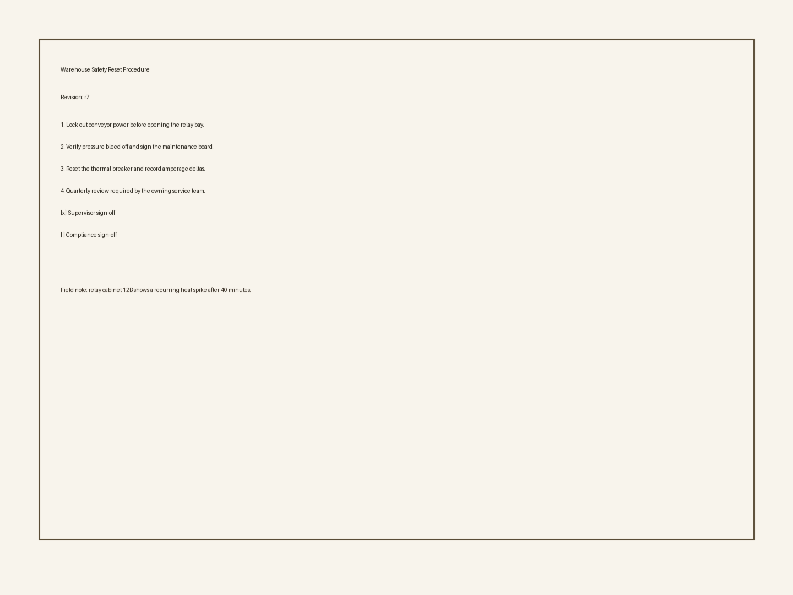

# multimodal-doc-intake-kit

Schema-first document intake service for turning PDF, DOCX, and image inputs into:

- validated typed records
- retrieval-ready chunks with provenance
- operator review tasks for ambiguous fields
- layout Markdown and embedding artifacts for downstream RAG pipelines

The repository ships with two execution modes:

- `deterministic`: in-memory, test-friendly, no network calls
- `azure`: live OCR/layout + LLM normalization + chunk embeddings

## Pipeline

```text
[local file | URL]
        |
        v
[Azure Document Intelligence: prebuilt-layout]
        |
        v
[gpt-5-mini normalization by profile]
        |
        +--> [review queue for mid-confidence fields]
        |
        v
[chunk builder]
        |
        v
[text-embedding-3-small]
```

The current live configuration uses:

- `prebuilt-layout` for OCR, table extraction, and layout Markdown
- `gpt-5-mini` for field normalization
- `gpt-5.4` as the intended adjudication tier for harder follow-up tasks
- `text-embedding-3-small` for retrieval vectors

## Profiles

- `contract_v1`
  - `counterparty_name`
  - `effective_date`
  - `termination_notice_days`
- `invoice_v1`
  - `invoice_number`
  - `currency`
  - `total_due_cents`
  - `vendor_name`
- `manual_v1`
  - `document_title`
  - `revision`
  - `requires_review_cycle`

## Included Demo Inputs

Generated demo documents live under [`demo/input`](./demo/input):

- [`enterprise-renewal-contract.docx`](./demo/input/enterprise-renewal-contract.docx)
- [`field-operations-invoice.pdf`](./demo/input/field-operations-invoice.pdf)
- [`warehouse-reset-scan.png`](./demo/input/warehouse-reset-scan.png)

The image input is intentionally noisy enough to trigger a realistic review path:



## Live Demo Output

The repository includes captured outputs from a live Azure-backed run in [`demo/output`](./demo/output).

Summary:

```json
[
  {
    "document_id": "contract-live-2026-04-15",
    "profile": "contract_v1",
    "status": "exported",
    "trace": ["prebuilt-layout", "gpt-5-mini", "text-embedding-3-small"]
  },
  {
    "document_id": "invoice-live-2026-04-15",
    "profile": "invoice_v1",
    "status": "exported",
    "trace": ["prebuilt-layout", "gpt-5-mini", "text-embedding-3-small"]
  },
  {
    "document_id": "manual-live-2026-04-15",
    "profile": "manual_v1",
    "status": "exported",
    "trace": ["prebuilt-layout", "gpt-5-mini", "text-embedding-3-small"]
  }
]
```

Invoice extraction excerpt:

```json
{
  "invoice_number": "INV-2048-APR",
  "currency": "USD",
  "total_due_cents": 1284450,
  "vendor_name": "Cascade Field Services"
}
```

Manual scan review path:

```json
{
  "revision": {
    "initial_value": "17",
    "review_action": "correct",
    "corrected_value": "r7"
  }
}
```

Contract chunk embedding artifact excerpt:

```json
{
  "chunk_id": "de55ec321afe71e63cc5e9a5a85ccef3e159b23c10293e1e999b39c1e8a252d6",
  "dimensions": 1536,
  "vector_preview": [-0.032795, 0.068723, 0.097257, 0.019036]
}
```

## API

- `POST /api/ingest`
- `GET /api/documents/{document_id}`
- `GET /api/artifacts/{document_id}`
- `POST /api/review/{document_id}`
- `GET /api/exports/{document_id}`
- `GET /healthz`

Example ingest request:

```bash
curl -X POST http://127.0.0.1:8000/api/ingest \
  -H "Content-Type: application/json" \
  -d '{
    "document_id": "invoice-live-2026-04-15",
    "source": {
      "uri": "/absolute/path/to/field-operations-invoice.pdf",
      "mime_type": "application/pdf",
      "checksum_sha256": "f349c0377448806316fed1124258ef77126a4f30506fa2f972fa1ba0644ee71e"
    },
    "profile": "invoice_v1",
    "locale": "en-US",
    "submitted_at": "2026-04-15T14:20:00Z",
    "metadata": {
      "tenant": "lab-demo"
    }
  }'
```

## Run

Prerequisites:

- Python `3.9+`
- `uv`

Install:

```bash
uv sync --extra dev --extra demo
```

Deterministic mode:

```bash
uv run uvicorn multimodal_doc_intake_kit.main:app --app-dir src --reload
```

Live Azure mode:

```bash
export DOC_INTAKE_PROVIDER=azure
export AZURE_DOCINTELLIGENCE_ENDPOINT="https://<resource>.cognitiveservices.azure.com/"
export AZURE_DOCINTELLIGENCE_API_KEY="<key>"
export AZURE_OPENAI_ENDPOINT="https://<resource>.openai.azure.com/"
export AZURE_OPENAI_API_KEY="<key>"
export AZURE_OPENAI_API_VERSION="2025-04-01-preview"
export AZURE_OPENAI_CHAT_DEPLOYMENT="gpt-5-mini"
export AZURE_OPENAI_REASONING_DEPLOYMENT="gpt-5.4"
export AZURE_OPENAI_EMBEDDING_DEPLOYMENT="text-embedding-3-small"

uv run uvicorn multimodal_doc_intake_kit.main:app --app-dir src --reload
```

## Reproduce The Demo

Generate the sample files:

```bash
uv run python scripts/generate_demo_inputs.py
```

Run the live end-to-end pipeline and write captured artifacts:

```bash
uv run python scripts/run_live_demo.py
```

Artifacts written:

- [`demo/output/demo-summary.json`](./demo/output/demo-summary.json)
- [`demo/output/contract-live-2026-04-15.export.json`](./demo/output/contract-live-2026-04-15.export.json)
- [`demo/output/invoice-live-2026-04-15.export.json`](./demo/output/invoice-live-2026-04-15.export.json)
- [`demo/output/manual-live-2026-04-15.review.json`](./demo/output/manual-live-2026-04-15.review.json)
- [`demo/output/manual-live-2026-04-15.export.json`](./demo/output/manual-live-2026-04-15.export.json)

## Azure Foundry Notes

Deployment and provider instructions live in [`docs/azure-foundry.md`](./docs/azure-foundry.md).

Short version:

- keep OCR/layout on Azure Document Intelligence
- keep schema normalization on a current chat/reasoning deployment (`gpt-5-mini` here)
- keep embeddings on `text-embedding-3-small`
- add a second reasoning tier only if you need explicit adjudication or post-review synthesis

## Equivalent Provider Stack

The Azure implementation is the only provider wired in code today. Equivalent stacks for the same design:

- Google Cloud
  - OCR/layout: Document AI layout parser or Enterprise Document OCR
  - normalization: `gemini-2.5-pro`
  - embeddings: `gemini-embedding-001`
- OpenAI-compatible stack
  - OCR/layout: external OCR service of choice
  - normalization: current structured-output capable model
  - embeddings: a small retrieval embedding model

## Project Layout

```text
.
├── demo/
│   ├── input/
│   └── output/
├── docs/
│   ├── architecture.md
│   ├── azure-foundry.md
│   ├── implementation-plan.md
│   └── pipeline-notes.md
├── schemas/
├── scripts/
│   ├── generate_demo_inputs.py
│   └── run_live_demo.py
├── src/multimodal_doc_intake_kit/
│   ├── azure_backend.py
│   ├── config.py
│   ├── main.py
│   ├── models.py
│   ├── pipeline.py
│   ├── service.py
│   └── store.py
└── tests/
```

## Test

```bash
uv run pytest -q
```
